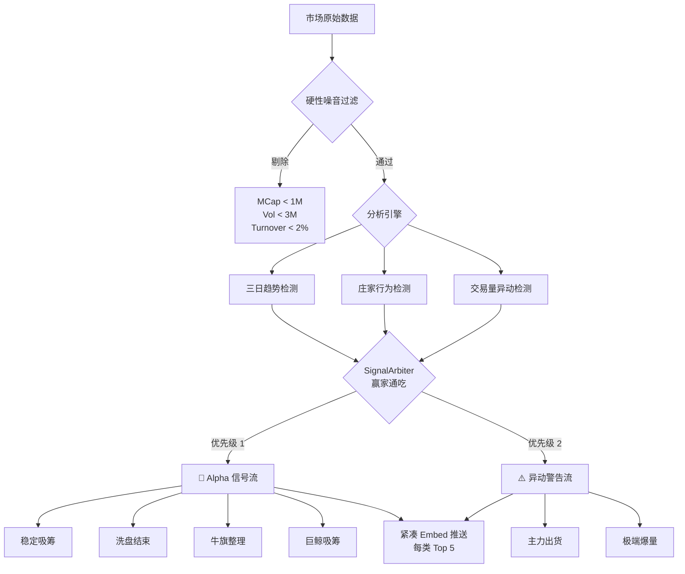

# Volume Monitor 模块说明

## 1. 核心功能
本模块 (`src/utils/volume_monitor.py`) 用于监控加密货币市场的交易量变化，结合价格行为和历史数据（3日趋势），识别主力资金的吸筹、洗盘和出货行为。

## 2. 推送架构 (Dual Stream Output)

采用 **双流输出** 架构，基于用户意图而非形态分类：



## 3. 推送类别 (仅两类)

### 3.1 🎯 Alpha 信号流 (High Confidence Long Setup)

> **用户意图**: 寻找买入/做多机会

| 子类型 | 特征 | 颜色 |
|--------|------|------|
| 稳定吸筹 | 连续3日量能稳定 + 价格横盘 | 紫色 |
| 洗盘结束 | 连续缩量 + 价格企稳 | 黄色 |
| 牛旗整理 | 昨日放量大涨 + 今日缩量回调 | 绿色 |
| 巨鲸吸筹 | 高置信度资金流入 (Score ≥ 0.8) | 蓝色 |

### 3.2 ⚠️ 异动警告流 (Anomalies & Risks)

> **用户意图**: 持仓避险或极度投机

| 子类型 | 特征 | 颜色 |
|--------|------|------|
| 主力出货 | 量增价跌，明显卖出信号 | 红色 |
| 极端爆量 | 极端交易量变化 (Vol ≥ 100%) | 橙色 |

## 4. SignalArbiter 去重逻辑

采用 **"赢家通吃" (Winner Takes All)** 策略，一个代币只会出现在一个分类中：

**优先级顺序:**
1. Trend (完美三日趋势) → Alpha
2. Accumulation (强力吸筹, score > 0.8) → Alpha
3. Distribution (出货) → 异动
4. Extreme Vol (极端波动) → 异动

## 5. 硬性过滤门槛

| 过滤维度 | 阈值 | 说明 |
|----------|------|------|
| 最低市值 | $1M | 剔除微型代币 |
| 最低交易量 | $3M | 确保流动性 |
| 最低换手率 | 2% | 剔除死盘 |

## 6. Embed 消息格式

所有推送均使用 Discord Embed 格式，紧凑展示：

```
🎯 Alpha: 洗盘结束 (5个)
连续缩量 + 价格企稳，卖盘枯竭

1. FOLKS (Folks Finance)
💵 $15.6 | 💰 MC $177.9M | FDV $729.1M
Vol -49% 📉 | Price +3.5% 📈 | 0.99 🔥
[大市值稳健] 连续缩量(49.4%)且价格企稳

2. SOON (SOON)
...
```

**关键信息一目了然:**
- 当前价格 (新增)
- 市值/FDV
- Vol/Price 变化率
- 置信度分数 + Emoji
- 市值标签 + 信号原因

## 7. 核心类说明

### 7.1 SignalArbiter
信号仲裁器，实现"赢家通吃"去重逻辑。

```python
arbiter = SignalArbiter()
alpha_signals, anomaly_signals = arbiter.classify(
    trend_signals=trend_signals,
    accumulation_alerts=accumulation_alerts,
    distribution_alerts=distribution_alerts,
    volume_alerts=volume_alerts
)
```

### 7.2 ClassifiedSignal
分类后的信号数据结构：

```python
@dataclass
class ClassifiedSignal:
    symbol: str
    name: str
    category: str      # alpha_trend, alpha_whale, risk_distribution, anomaly_extreme
    sub_type: str      # WASH_COMPLETE, ACCUMULATION_STABLE, etc.
    score: float       # 置信度 0-1
    mcap_tag: str      # 市值标签
    data: dict         # 原始数据
    reason: str        # 信号原因
```

### 7.3 ConfidenceEngine
置信度计算引擎，基于市值分层和换手率健康度进行加权评分。

## 8. 使用方式

```bash
# 运行监控
python src/utils/volume_monitor.py

# 调试模式（不发送消息）
python src/utils/volume_monitor.py --debug

# 自定义阈值
python src/utils/volume_monitor.py --threshold 60
```
