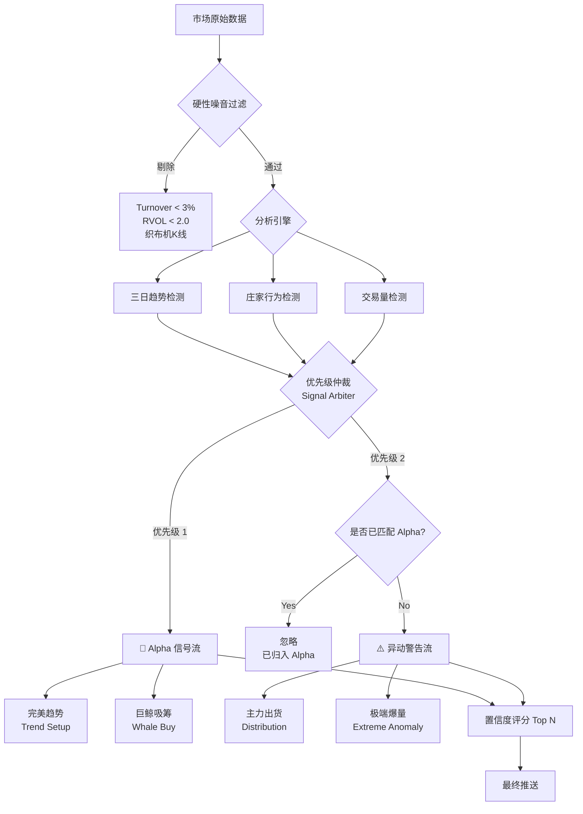

# Volume Monitor 模块优化方案 (Optimization Plan)

## 1\. 背景与痛点 (Context)

当前 `src/utils/volume_monitor.py` 模块虽然能识别多种市场行为，但存在显著的**低信噪比 (Low Signal-to-Noise Ratio)** 问题：

  * **重复冗余**: 同一个代币在不同榜单（趋势、吸筹、异动）重复出现。
  * **噪音干扰**: 低流动性的“僵尸币”因偶尔波动被误报。
  * **信息过载**: 4个分类分散了用户的注意力，缺乏明确的操作指向性。

## 2\. 核心优化策略：双流输出 (Dual Stream Strategy)

为了解决分类混乱的问题，我们将推送类别从基于“形态”改为基于**用户意图 (User Intent)**，合并为两条核心数据流：

### 2.1 🎯 第一流：Alpha 信号 (Alpha Signals)

> **用户意图**: 寻找买入/做多机会 (High Confidence Long Setup)。

  * **合并内容**:
    1.  **三日趋势 (Trend Signals)**: 完美符合“吸筹/洗盘结束/牛旗”模型。
    2.  **强力吸筹 (Strong Accumulation)**: 虽无完美形态，但单日主力净买入极大且价格稳健。
  * **逻辑**: 无论是形态驱动还是资金驱动，本质都是主力看涨，应统一归类按置信度排序。

### 2.2 ⚠️ 第二流：异动与风控 (Anomalies & Risks)

> **用户意图**: 持仓避险 (Risk Management) 或 极度投机 (Speculation)。

  * **合并内容**:
    1.  **主力出货 (Distribution)**: 量增价跌，明显的卖出信号。
    2.  **极端异动 (Extreme Volatility)**: 纯粹的暴涨暴跌（如 PUMP），未经过稳健性验证。
  * **逻辑**: 提示风险或极端波动，与稳健买入信号做严格隔离。

-----

## 3\. 详细实施方案 (Implementation Details)

### 3.1 漏斗式过滤：硬性门槛 (Hard Filtering)

在进入分析引擎前，必须先剔除无效噪音。引入动态指标而非静态数值：

| 过滤维度 | 新标准 (New Thresholds) | 逻辑理由 (Rationale) |
| :--- | :--- | :--- |
| **最低换手率** | `Turnover > 10%` (日级别) | - |
| **相对量能 (RVOL)** | `Current_Vol > 2.0 * Avg_Vol_7d` | 只有比过去7天平均量能放大2倍以上才值得关注。 |
| **价格形态** | `High_Low_Spread > 2%` | 剔除“织布机”行情（心电图式K线），确保有真实交易博弈。 |
| **最低交易量** | `Min($3M, Top 500 Vol)` | 动态调整，熊市降低，牛市升高。 |

### 3.2 赢家通吃：去重逻辑 (Waterfall Deduplication)

采用 **"赢家通吃" (Winner Takes All)** 策略，按照优先级从上到下匹配，一旦命中即终止后续判定。

**优先级顺序**:

1.  **Trend (完美趋势)**: 优先级最高，归入 🎯 Alpha。
2.  **Accumulation (强力吸筹)**: 优先级次之，归入 🎯 Alpha。
3.  **Distribution (出货)**: 归入 ⚠️ 异动。
4.  **Extreme Vol (极端波动)**: 只有上述都不符合时，才检查此项，归入 ⚠️ 异动。

**伪代码逻辑**:

```python
def classify_token(token_data):
    # Priority 1: 完美形态 (Alpha)
    if check_3day_trend(token_data):
        return "🎯 Alpha Signal (Trend)"
    
    # Priority 2: 强力吸筹 (Alpha)
    # 需极高置信度才会被捕获
    if check_dealer_accumulation(token_data) and token_data['score'] > 80:
        return "🎯 Alpha Signal (Whale)"
        
    # Priority 3: 明确出货 (Risk)
    if check_dealer_distribution(token_data):
        return "⚠️ Risk (Distribution)"
        
    # Priority 4: 极端异动 (Anomaly)
    # 仅保留数据极度夸张的代币
    if check_extreme_volume(token_data) and token_data['turnover'] > 5%:
        return "⚠️ Anomaly (Extreme Vol)"
        
    return None # 丢弃噪音
```

### 3.3 置信度评分 (Confidence Scoring)

为了防止刷屏，每条数据流只推送 **Top 5 - Top 10**。

  * **评分公式**: `Score = (Trend_Weight * 0.4) + (Vol_Multiplier * 0.4) + (Mcap_Weight * 0.2)`
  * **作用**: 即使有20个币符合条件，只给用户看形态最完美、量能最异常、市值最靠谱的前几名。

-----

## 4\. 逻辑流程图 (Process Workflow)



-----

## 5\. 下一步行动 (Action Items)

1.  **重构代码结构**:
      * 在 `src/utils/` 下新建或修改 `SignalArbiter` 类，实现上述“赢家通吃”的 `classify_token` 逻辑。
2.  **更新过滤参数**:
      * 将静态的 Volume 阈值改为包含 RVOL 和 Turnover 的动态阈值。
3.  **回测验证**:
      * 选取过去 7 天的市场数据，运行新逻辑。
      * **成功标准**: 每日推送总量减少 60% 以上，且涨幅榜前 10 的代币至少有 3 个曾出现在“Alpha 信号流”中。